<div align="center">


<a href="https://github.com/milenorl">
  
</a>

</div>

<br>

## 🧭 Sobre mim

```txt
const lucas = {
    cargo: "Infrastructure Services Analyst II @ DXC Technology",
    formacao: "Análise e Desenvolvimento de Sistemas (Estácio, 2024–2026)",
    local: "Vitória, ES - Brasil",
    trajetoria: [
        "Técnico de Suporte em TI - Hospital Estadual Dr. Jayme Santos Neves (AEBES)",
        "Técnico de Suporte em Informática - Supriservice Informática",
        "Atendente de Service Desk - Sollo Brasil Contact Center",
        "Técnico de Campo de TI - GMUD Tecnologia",
        "Infrastructure Services Analyst II - DXC Technology"
    ],
    foco_atual: [
        "Suporte e infraestrutura de TI corporativa",
        "Automação de rotinas (Excel + ServiceNow)",
        "Estudos em desenvolvimento web e cloud"
    ],
    filosofia: "Se é repetitivo, dá pra automatizar."
};
```

Comecei no suporte técnico de ponta a ponta — service desk, campo, ambiente hospitalar — até chegar à infraestrutura corporativa na DXC Technology. No caminho, percebi que boa parte do trabalho manual pode virar script, e é isso que venho estudando e construindo enquanto termino a faculdade de ADS. <br>
Curto documentar processos com clareza, testar automações antes de confiar nelas e manter tudo versionado.

<br>

## 🏅 Reconhecimentos


> Reconhecido entre os destaques da equipe por atitudes de colaboração, dedicação e impacto positivo no atendimento aos clientes.

<br>

## 🛠️ Tecnologias e Ferramentas

<div align="center">


<br><br>


<br><br>


</div>

<br>

## 🚀 Projetos

<table align="center">
  <tr>
    <td width="50%">
      <a href="https://github.com/milenorl/milenorl.github.io">
        
      </a>
    </td>
  </tr>
</table>

<!-- Para adicionar um novo projeto, duplique o bloco <tr><td> acima trocando o link e o texto do badge. -->

<br>

## 📊 GitHub Stats & Linguagens

<div align="center">


</div>

<br>

## 🔥 Streak

<div align="center">


</div>

<br>

## 🏆 Trophies

<div align="center">



</div>

<br>

## 🐍 Contribution Snake

<div align="center">

<picture>
  <source media="(prefers-color-scheme: dark)" srcset="https://raw.githubusercontent.com/milenorl/milenorl/output/github-contribution-grid-snake-dark.svg" />
  <source media="(prefers-color-scheme: light)" srcset="https://raw.githubusercontent.com/milenorl/milenorl/output/github-contribution-grid-snake.svg" />
  
</picture>

</div>

<br>

## 🌐 Redes sociais

<div align="center">

<a href="https://www.linkedin.com/in/lucas-mileno-2aa190271" target="_blank">
  
</a>
<a href="https://www.instagram.com/milenorl.dev" target="_blank">
  
</a>
<a href="https://milenorl-dev.carrd.co/" target="_blank">
  
</a>
<a href="mailto:milenorl.dev@outlook.com" target="_blank">
  
</a>

</div>

<br>

<div align="center">
<sub>Feito com café ☕, chamados resolvidos 🎫 e uma boa playlist tocando ao fundo 🎧</sub>


</div>
